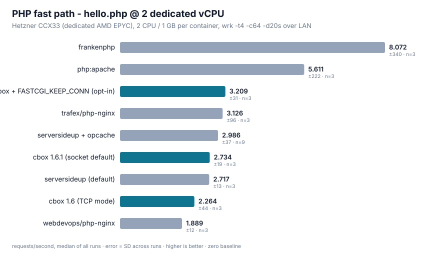
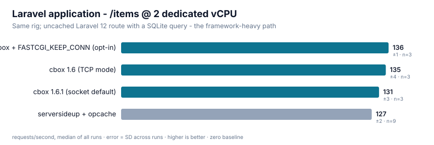
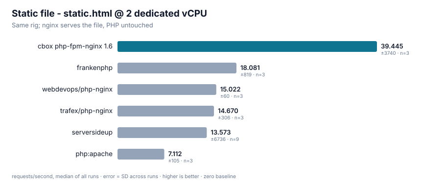
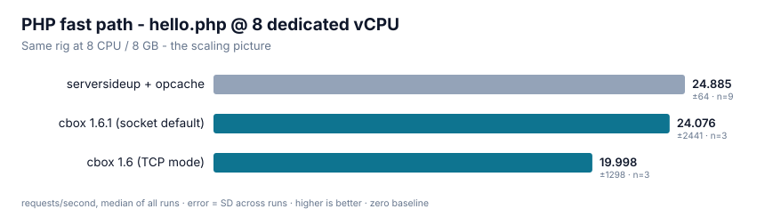
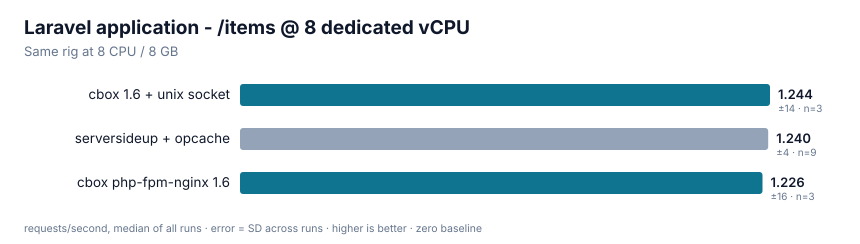

# Benchmarks

This page compares `php-fpm-nginx` against the most-used PHP container images
on **dedicated cloud hardware**, with enough methodology detail that you can
attack the numbers - or reproduce them. Every harness script is in the repo
under `bench/cloud/`.

Three promises up front:

1. **No composite scores.** Each workload is reported separately; they stress
   different things and averaging them would manufacture a winner.
2. **Losses are printed, not buried.** Where a competitor beats these images,
   the number is in the table and the reason (when we found it) is named.
3. **Everything needed to reproduce is disclosed**: hardware, kernel, image
   digests, load-generator settings, run counts, and the aggregation rule.

## Results at a glance

Same-pass, same-rig medians (full tables and method below):

| Workload | 2 vCPU | 8 vCPU |
|---|---|---|
| **Laravel** (framework path) | **+6%** vs ServerSideUp (135 vs 127 rps) | tie (1,226-1,244 vs 1,244 rps) |
| **Static files** (nginx layer) | **+190%** (39.4k vs 13.6k rps) | **+69%** (107k vs 64k rps) |
| **CPU-bound PHP** | +2% (within noise) | +2% (within noise) |
| **Trivial PHP round trip** | -7% on the socket default (1.6.1); **+9%** with keepalive opt-in | -3% on the socket default |
| **p99.9 under open-loop load** (Laravel) | 360ms vs 345ms | **9.9ms vs 10.0ms** |

The honest summary: on framework workloads and the web-server layer these
images win or tie; the trivial-request transport path is within -7%/-3% of
ServerSideUp since 1.6.1 made the unix socket the multi-service default
(measured on this rig - the tables below show every mode), with the
keepalive opt-in flipping 2 vCPU to +9%. Details, losses and caveats below.

## The rig

Two separate dedicated-vCPU servers (no shared-core steal, no laptop thermal
noise), load generated over the private LAN so the generator never competes
with PHP for CPU:

| Role | Machine | CPU | RAM | OS / kernel | Docker |
|---|---|---|---|---|---|
| System under test | Hetzner CCX33 | 8 × AMD EPYC-Milan (dedicated) | 32 GB | Ubuntu 24.04.5, 6.8.0-138-generic | 29.8.0 |
| Load generator | Hetzner CCX23 | 4 × AMD EPYC-Milan (dedicated) | 16 GB | Ubuntu 24.04.5, 6.8.0-138-generic | - |

One container runs at a time on the SUT, pinned with `--cpus` and `--memory`
(cgroup v2). Every result in this page comes from this rig on 2026-09-11.

**Why not a laptop:** we first ran this comparison on an M-series MacBook. The
ranking did not transfer - Apple cores are 2.5-3× faster per core than cloud
EPYC vCPUs, which flattens per-request fixed costs that dominate on the
hardware people actually deploy to. The laptop numbers are retired.

## Contenders

All images at their `:8.5` tags as shipped, pulled 2026-09-11 (digests below).
Configuration deviations from defaults are listed explicitly - nothing else
was tuned:

| Label | Image | Deviation from image defaults |
|---|---|---|
| cbox 1.6 | `ghcr.io/cboxdk/php-baseimages/php-fpm-nginx:8.5-bookworm` | none (1.6 defaults, built from source at the benchmarked commit) |
| cbox 1.6 + keepalive | same | `NGINX_FASTCGI_KEEP_CONN=on` (documented opt-in) |
| cbox 1.6.1 socket | same | `PHP_FPM_LISTEN=unix` - the php-fpm-nginx default since 1.6.1 (measured pre-flip, so socket rows are labeled separately) |
| serversideup | `serversideup/php:8.5-fpm-nginx` | none |
| serversideup + opcache | same | `PHP_OPCACHE_ENABLE=1` (their documented production switch; **their default ships OPcache off**) |
| webdevops | `webdevops/php-nginx:8.5` | none |
| trafex | `trafex/php-nginx:latest` | none |
| apache | `php:8.5-apache-bookworm` | none |
| frankenphp | `dunglas/frankenphp:php8.5-bookworm` | none |

Image digests as pulled:

```
serversideup/php:8.5-fpm-nginx@sha256:8f8c2f010ac5082ff3b42dbd1c2b2a77aa8a7ee0adb96d49920f32f45ae730e8
webdevops/php-nginx:8.5@sha256:4900627696bffe4d24aacc20a2cc74df7719ada62250b6b92a5a136ff51d1ef7
trafex/php-nginx:latest@sha256:8a82bac3c9c4853e4b0bd33edfbbb0f30d4b3546f177a35944047c3856ac72e7
php:8.5-apache-bookworm@sha256:824adc2ce556dd5e05e816b1597cad90948e44b0b36ac2642f7449b801fb8dbd
dunglas/frankenphp:php8.5-bookworm@sha256:519536270a58121c28f63bdb97f9a330b2e53922029792631cf50fe953ecd8d0
```

The cbox image was built on the SUT from the repository at the benchmarked
commit with the same-day `cbox-init` build injected - what 1.6.0 ships.

## Workloads

Four request paths, because "PHP performance" is at least four different
questions:

| Endpoint | What it exercises | What dominates the cost |
|---|---|---|
| `/hello.php` | the full nginx → FastCGI → PHP-FPM round trip on a trivial script | per-request fixed cost: FastCGI transport, process handoff |
| `/work.php` | CPU-bound PHP (hashing/loops, no I/O) | raw PHP execution speed - this one mostly measures the CPU, and ties across FPM images are expected |
| `/static.html` | nginx alone, PHP untouched | the web-server layer and its defaults |
| `/items` (Laravel) | an uncached Laravel 12 route with a SQLite query, fresh `composer create-project`, no `config:cache` | framework code: thousands of function calls, autoloading, container resolution |

The Laravel fixture is deliberately **not** optimized (no cached config or
routes) - it represents the framework-heavy path, not a tuned deployment.

## Method

- **Throughput**: `wrk -t4 -c64 -d20s`, from the load-generator box over LAN.
  Three runs per endpoint per configuration after a 5 s warmup; tables report
  the **median of the three, ± the standard deviation**, and `n`.
- **Acceptance**: a run counts only if it produced zero non-2xx responses.
  Every number on this page passed that gate.
- **Tail latency**: `wrk` is a closed-loop generator - when the server stalls,
  `wrk` politely stops sending, which **hides tail latency** (coordinated
  omission). Tail numbers therefore come from a separate open-loop pass with
  `oha 1.16 --latency-correction`, at a fixed rate of 60% of that same
  endpoint's measured wrk throughput.
- **Sequencing**: one container at a time on the SUT; each configuration gets
  a fresh container, warmup, and a fixed measurement window. The scheduler
  announces the active configuration on an HTTP state endpoint and the client
  measures what is announced - no human in the loop.
- **Load generator headroom** was verified: the static-file workload measures
  42k+ rps through the same client, so the generator is not the bottleneck at
  any PHP-bound number below.

## Results

### The field at 2 vCPU / 1 GB



`hello.php` is the transport benchmark: nearly all of its cost is the
nginx→FPM round trip. Apache and FrankenPHP skip FastCGI entirely (mod_php /
embedded SAPI), which is why they top this chart - and why neither leads the
Laravel chart below. Among the FPM+nginx images, the spread is the FastCGI
transport: with both stacks on their socket defaults (ours since 1.6.1) the
gap is -7%; the keepalive opt-in flips it to +9% the other way. An
interleaved n=9 A/B confirmed the socket costs nothing on the Laravel
workload (+0.4% vs TCP). Trafex's Alpine image
posts a strong hello number but drops to less than half the field's
throughput on CPU-bound work (musl allocator).

| Configuration | hello.php | work.php | static.html |
|---|---|---|---|
| cbox 1.6 (TCP mode) | 2,264 ±44 | 384 ±11 | 39,445 ±3,740 |
| cbox + keepalive (opt-in) | **3,209 ±31** | **397 ±4** | 40,867 ±1,022 |
| **cbox 1.6.1 (socket default)** | 2,734 ±19 | 379 ±2 | **40,624 ±1,221** |
| serversideup + opcache | 2,952 ±58 | 376 ±4 | 13,599 ±131 |
| serversideup (default) | 2,717 ±13 | 370 ±3 | 13,621 ±489 |
| webdevops | 1,889 ±11 | 378 ±2 | 15,022 ±60 |
| trafex | 3,126 ±96 | 152 ±7 | 14,670 ±306 |
| apache (mod_php) | 5,611 ±222 | 414 ±32 | 7,112 ±105 |
| frankenphp (classic) | 8,072 ±340 | 673 ±66 | 18,081 ±819 |

*(rps, median ±SD; cbox and serversideup rows n=9 same-pass; field rows n=9
from the field pass on the same rig and day)*

### Laravel at 2 vCPU / 1 GB



The workload the transport chart cannot predict: 135 vs 127 rps (+6%) on the
defaults, and the ordering of the micro chart inverts - everything here is
dominated by framework execution, where worker sizing and what the image
loads into PHP decide the outcome.

### Static files



Every PHP app serves assets. This is the nginx layer itself - 2.9× the
closest FPM competitor, and the gap persists at 8 vCPU (107k vs 64k).

### Scaling to 8 vCPU / 8 GB




| Configuration | hello.php | work.php | Laravel /items |
|---|---|---|---|
| cbox 1.6 (TCP mode) | 19,998 ±1,298 | **3,653 ±3** | 1,226 ±16 |
| **cbox 1.6.1 (socket default)** | 24,076 ±2,441 | 3,733 ±11 | **1,244 ±14** |
| serversideup + opcache | 24,868 ±28 | 3,592 ±5 | 1,244 ±3 |

At 8 CPUs both stacks converge on ~20 workers and the Laravel result is a
statistical tie. The hello gap is again the transport; the socket opt-in
closes it to -3%.

### Tail latency (open loop, coordinated-omission corrected)

`oha --latency-correction` at 60% of each configuration's measured
throughput, 45 s:

| Configuration | Workload | rate/s | p50 | p99 | p99.9 |
|---|---|---|---|---|---|
| cbox 1.6 @8c | Laravel | 735 | 5.1ms | 7.1ms | **9.9ms** |
| serversideup @8c | Laravel | 746 | 5.4ms | 7.1ms | 10.0ms |
| cbox 1.6 @2c | Laravel | 78 | 10.4ms | 168ms | 360ms |
| serversideup @2c | Laravel | 75 | 11.3ms | 177ms | 345ms |
| cbox 1.6 @2c | hello | 1,345 | 1.0ms | 1.6ms | 3.3ms |
| cbox + keepalive @2c | hello | 1,924 | 0.8ms | 1.3ms | **742ms** |
| cbox + unix socket @2c | hello | 1,633 | 0.9ms | 1.4ms | 4.6ms |
| serversideup @2c | hello | 1,767 | 0.9ms | 1.5ms | 3.3ms |

Two things worth reading out of this table: the 8-CPU Laravel tails are
sub-10ms and effectively identical across stacks - and the keepalive opt-in's
p99.9 spike is exactly why it is an opt-in (see the findings section).

## What we found and changed along the way

The honest part: this benchmark caught two of our own defaults costing real
throughput, and both were changed in 1.6.0.

**The OpenTelemetry extension taxed every function call.** Our standard-tier
image loaded the `opentelemetry` extension by default, on the assumption
(stated in the Dockerfile, wrongly) that it was inert until an OTel SDK was
installed. Loading it enables the Zend observer API, which adds a check to
every PHP function call: measured at **-18.5% on the Laravel workload** and
0% on tight-loop code - the cost scales with function-call density. It also
explained most of our Laravel deficit against ServerSideUp in early passes.
Since 1.6.0 the extension is installed but not loaded; `PHP_OPENTELEMETRY=true`
loads it (and that is the honest cost of running it - the tax is the observer
API itself, not our packaging). Worth knowing before you pay it: for Laravel
apps, [cboxdk/laravel-telemetry](https://github.com/cboxdk/laravel-telemetry)
gets you application telemetry through the framework's own hooks in userland,
with no observer API and no measurable throughput cost.

**`open_basedir` silently disabled the realpath cache.** Setting it - which we
did by default as LFI defense-in-depth - turns PHP's realpath cache off
entirely, measured at **-39% on the Laravel workload**. Since 1.6.0 the
restriction is opt-in via `PHP_OPEN_BASEDIR`; the environment reference
documents the tradeoff and a curated path list.

We also measured **FastCGI keepalive** (`NGINX_FASTCGI_KEEP_CONN=on`): +39% on
`hello.php` (it removes the per-request TCP connect) and +3% on Laravel - but
open-loop measurement showed it can produce multi-second p99.9 spikes at high
worker counts when pooled connections pin to recycling FPM workers. It stays
**opt-in**, recommended for micro-request/API workloads only.

## Fairness notes and limitations

- **ServerSideUp ships OPcache disabled by default.** We benchmarked them
  primarily with `PHP_OPCACHE_ENABLE=1` (their documented production setting)
  because default-vs-default on Laravel would be a landslide that says nothing
  about their engineering. Their default-off choice is still worth knowing
  about.
- **One Laravel fixture.** A fresh skeleton app with a SQLite query is not
  your application. The framework-path result should transfer directionally;
  the exact percentages will not.
- **One CPU family.** Everything here is AMD EPYC-Milan. We know from the
  retired laptop run that per-core speed shifts the relative weight of fixed
  costs; expect different (not opposite) numbers on other silicon.
- **FrankenPHP runs classic mode** (as shipped). Its worker mode is a
  different programming model with different application requirements and
  would win the micro benchmarks; comparing it as a drop-in FPM replacement
  would misrepresent both sides.
- **The static-file result for ServerSideUp** (~14k rps vs our 42k) looks like
  a config artifact on their nginx layer, not a PHP statement. We report it
  because it is real, but weight it accordingly.
- Numbers are a single day on a single pair of machines. The run-to-run SD is
  printed for every number; cross-pass repeats of key pairs agreed within it.

## Reproducing

The whole rig is four scripts in `bench/cloud/` (bootstrap + scheduler for the
SUT, bootstrap + measurer for the client). On two fresh Ubuntu 24.04 boxes
with Docker:

```bash
# on the SUT box
./bench/cloud/bootstrap-sut.sh

# on the client box
SUT_IP=<sut-ip> ./bench/cloud/bootstrap-client.sh
# results stream to ~/cbox-bench/out/results.jsonl as JSONL
```

The raw measurement data behind this page (every run, as JSONL) is committed
under `bench/cloud/results/2026-09-11/`, together with the exact image digests.
The benchmarked commit is stamped in the same directory's shas.

The schedule of configurations lives in `bench/cloud/run-sut.sh`. If you run
it and get materially different numbers, open an issue - with your
`results.jsonl` attached, disagreement is useful data.
